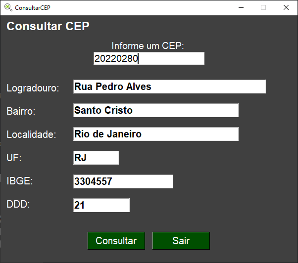

# Brazilian Zip Code Lookup
A program made in Python, using the PySimpleGUI framework, which has the purpose of searching for state data based on the Brazilian postal code (CEP). 
>Programa feito em Python, utilizando o framework PySimpleGUI, no qual possui a finalidade de pesquisar os dados do estado baseado no código postal brasileiro(CEP).

## Objective
The program searches for a state's data based on the zip code entered. From there, the program will present in the GUI itself, the data from that ZIP code.
Presenting the:
- Street Address
- Neighborhood
- Locality
- STATE
- IBGE
- AREA CODE

## Instructions

- Open your terminal, install the PySimpleGUI;
```txt
pip install PySimpleGUI 
```
- Run the program "app_ConsultCEP.py" in cmd or an IDE;

- Enter a valid Brazilian zip code. 



